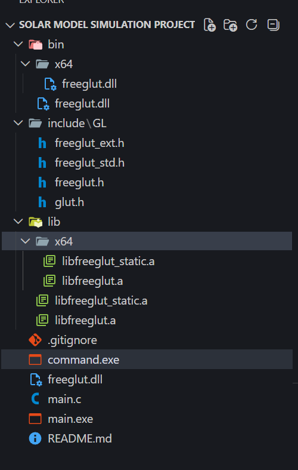

# 🌌 3D Solar System Simulation


> *An immersive, real-time 3D OpenGL simulation of our solar system featuring orbital mechanics, dynamic lighting, and procedural space environments. Developed as a 2nd Year, 1st Semester academic project.* 🚀

---

## 📸 Sneak Peek


---

## ✨ Key Features
* ☀️ **Dynamic Lighting:** Centralized illumination from the Sun with custom ambient and diffuse shading for realistic day/night cycles on planets.
* 🌍 **Accurate Celestial Mechanics:** Simulated orbital revolutions and axial spins running smoothly on a 16ms render loop.
* 🪐 **Detailed Environments:** 
  * Custom 3D Torus implementations for **Saturn's rings**.
  * A dynamic **Asteroid Belt** containing 200 scattered asteroids.
  * **Earth's Moon** synchronously orbiting our home planet.
* ✨ **Procedural Galaxy:** A deep-space background featuring 500 randomly generated stars.
* 🔤 **Real-Time Typography:** Rasterized on-screen bitmap labels for all celestial bodies.

---

## 🗂️ Project Structure

The repository contains all necessary dependencies natively in the `/include` and `/lib` folders, meaning **no system-wide OpenGL/GLUT installations are required**! 🛠️

Here is how the local workspace is structured:



---

## 🚀 Getting Started

### 1️⃣ Prerequisites
Make sure you have **GCC** (MinGW for Windows) installed. All required FreeGLUT headers and library files are already bundled in this repository.

### 2️⃣ Compilation
Open your terminal in the root directory and run this command to compile the project:
```bash
gcc main.c -o main.exe -I"./include" -L"./lib" -lopengl32 -lfreeglut -lglu32

```

### 3️⃣ Execution

Run the compiled executable:

```bash
./main.exe

```

**⚠️ Crucial Note:** Ensure `freeglut.dll` is located in the exact same root directory as your compiled `main.exe` before running!

---

## 🎮 Controls

Take control of the camera viewport with the following keyboard commands:

| Key | Action |
| --- | --- |
| `W` / `w` | 🔍 Zoom In (Move camera forward on the Z-axis) |
| `S` / `s` | 🔎 Zoom Out (Move camera backward on the Z-axis) |
| `ESC` | ❌ Exit the simulation |

---

## 📫 Author & Contact
**Bishal Roy**  

*Feel free to reach out if you have any questions about the project, suggestions for improvement, or if you just want to connect!* 🤝

* 📧 **Email:** [roybishal4004@gmail.com](mailto:roybishal4004@gmail.com)

---

## 📄 License
This project is open-source and available under the **MIT License**. Feel free to explore, learn, and modify!
